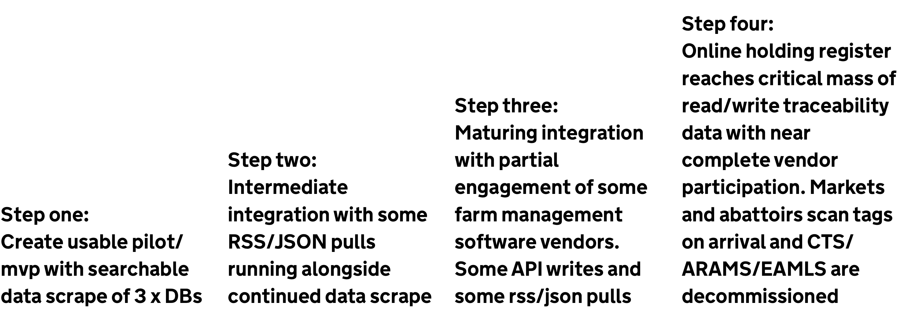
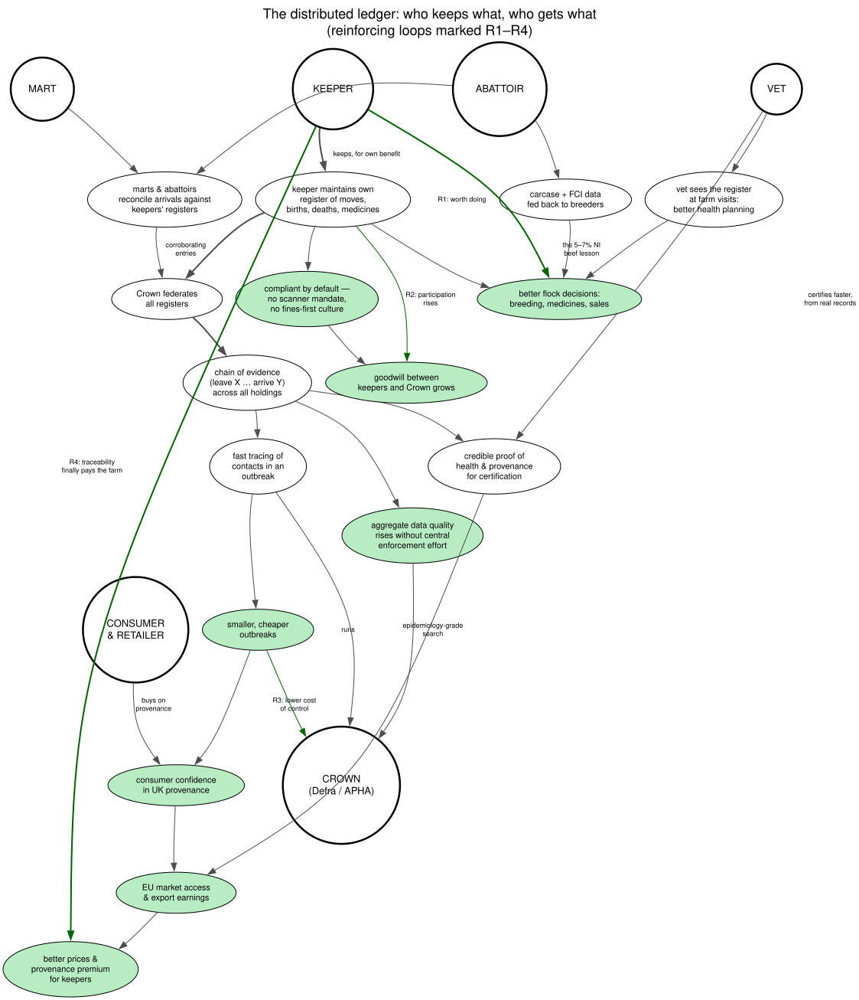

# Two ideas worth re-examining

Two proposals from the 2017–18 service design work are worth pressure-testing against today's programme. Neither was taken forward at the time; both were answers to problems that still exist.

## 1. The maturity ladder

A budget argument from early 2018: rather than a big-bang replacement, move traceability up one step at a time, each step delivering a working service.

The four steps:

1. **Read-only data scrape** of CTS/ARAMS/eAML2 into one cross-species events database (animal ID, holding, timestamps), refreshed hourly, with a simple GOV.UK front end for ~50 APHA/RPA/FSA pilot users — including the epidemiology killer query: list every animal a given animal has shared a holding with.
2. **Partial integration** — feeds and APIs from opted-in farm software, with de-duplication and quality checks so the aggregate is always at least as good as the sources.
3. **Maturing integration** — most vendors participating, read/write, mature front end.
4. **Critical mass** — markets and abattoirs scan on arrival; the legacy systems are decommissioned.

The design principle: every step is independently useful, and no step requires policy, data or reporting behaviour to change before value appears.

## 2. The distributed ledger

The core inversion: central-scanning compliance gives keepers no value and breeds resentment ("buy a scanner, scan at every gate, or be fined"). Instead: **look after your own flock and you are compliant.** Each keeper maintains their own register of moves, births, deaths and medicines because it is useful to *them*. The Crown federates all the registers — keepers', marts', abattoirs' — into a chain of evidence (leave X … arrive Y) without mandating hardware at every gate.

Four reinforcing loops make the ecosystem self-sustaining:

- **R1 — worth doing:** the register improves the keeper's own flock decisions (breeding, medicines, sales), so it gets kept.
- **R2 — participation:** compliance-by-default replaces the fines-first culture; goodwill grows; participation rises; the federated picture gets better.
- **R3 — disease:** the chain of evidence makes outbreak tracing fast; outbreaks get smaller and cheaper; the Crown's cost of control falls.
- **R4 — trade pays the farm:** credible proof of health and provenance makes vet certification and EU market access easier; consumer confidence adds a provenance premium; better prices flow back to the keeper — traceability finally pays the farm.

Plus two sweeteners: abattoirs feed carcase and food chain information back to breeders (the 5–7% NI beef productivity lesson), and vets use the register at farm visits for better health planning — both strengthen R1.

Whether or not the mechanism is right for 2026, the underlying principle carries: **design so that compliance is a by-product of something the keeper already wants to do.** See [Recommendations](recommendations).
